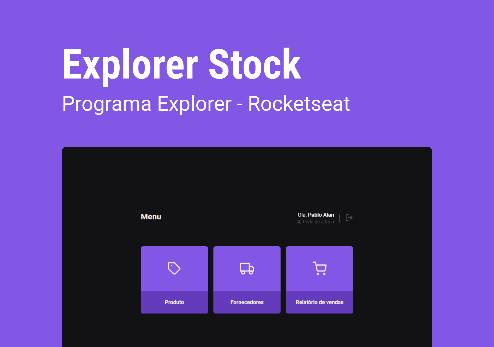

<h1 align="center">
  
  Explorer Stock
</h1>

<p align="center">
  

  
  
  <a href="https://github.com/pabloxt14/explorer-stock/commits/main">
    
  </a>
    
   

   <a href="https://github.com/pabloxt14/explorer-stock/stargazers">
    
  </a>
</p>

<p>
  
</p>

<h4 align="center"> 
	🚧 Aplicação em desenvolvimento 🚧
</h4>

<p align="center">
 <a href="#-about">About</a> |
 <!-- <a href="#-deploy">Deploy</a> | -->
 <a href="#-layout">Layout</a> | 
 <a href="#-how-it-works">How It Works</a> | 
 <a href="#-technologies">Technologies</a> | 
 <a href="#-author">Author</a> | 
 <a href="#-license">License</a>
</p>


## 💻 About

O Explorer Stock é uma aplicação simples de estoque, sem muitas funcionalidades e usabilidade pois seu intuito principal somente treinar o conceito de `Autenticação e Autorização` de forma profissional e segura entre o `Front-End` e `Back-End` da aplicação.

Vale ressaltar que este projeto foi desenvolvido como parte do curso/trilha Explorer oferecido pela Rocketseat.

---

## 🎨 Layout

Veja uma demonstração visual das principais telas da aplicação a seguir.

<!-- <p align="center">
  
</p>

<p align="center">
  
</p> -->

---

## 🚀 How it works

Este projeto é divido em 2 partes:
1. Back-end (pasta api) 
2. Front-end (pasta web)

💡 O Front-end precisam que o Back-end esteja sendo executado para funcionar.

### Pré-requisitos

Antes de baixar o projeto você vai precisar ter instalado na sua máquina as seguintes ferramentas:

* [Git](https://git-scm.com)
* [NodeJS](https://nodejs.org/en/)
* [Yarn](https://yarnpkg.com/), [NPM](https://www.npmjs.com/) (ou outro gerenciador de pacotes)

Além disto é bom ter um editor para trabalhar com o código como [VSCode](https://code.visualstudio.com/)

#### 🎲 Rodando o Backend (servidor)

```bash
# Clone este repositório
$ git clone git@github.com:pabloxt14/explorer-stock.git

# Acesse a pasta do projeto no terminal/cmd
$ cd explorer-stock

# Vá para a pasta server
$ cd api

# Instale as dependências
$ npm install

# Executar o seguinte comando para criar as migrations no banco
$ npm run migrate

# Execute a aplicação em modo de desenvolvimento
$ npm run dev

# O servidor inciará na porta:3333 - acesse http://localhost:3333 
```

#### 🧭 Rodando a aplicação web (Frontend)

```bash
# Vá para a pasta da aplicação Front End
$ cd web

# Instale as dependências
$ npm install

# Execute a aplicação em modo de desenvolvimento
$ npm run dev

# A aplicação inciará em alguma porta disponível que poderá ser acessada pelo navegador
```

---

## 🛠 Technologies

As seguintes ferramentas foram usadas na construção do projeto:

#### **Server**  ([NodeJS](https://nodejs.org/en/)

-   **[Express](https://expressjs.com/pt-br/)**
-   **[Knex](https://knexjs.org/)**
-   **[SQLite](https://www.sqlite.org/index.html)**
-   **[bcryptjs](https://www.npmjs.com/package/bcryptjs)**
-   **[jsonwebtoken](https://www.npmjs.com/package/jsonwebtoken)**
-   **[cookie-parser](https://www.npmjs.com/package/cookie-parser)**

> 📘 **Info**
>
> Para mais detalhes das dependências gerais do front-end veja o arquivo [package.json](https://github.com/PabloXT14/explorer-stock/blob/main/api/package.json)

#### **Website**  ([Vite](https://vitejs.dev/)  +  [TypeScript](https://www.typescriptlang.org/))

-   **[Styled Components](https://styled-components.com/)**
-   **[React Icons](https://react-icons.github.io/react-icons/)**
-   **[Axios](https://axios-http.com/ptbr/)**

> 📘 **Info**
>
> Para mais detalhes das dependências gerais do back-end veja o arquivo [package.json](https://github.com/PabloXT14/explorer-stock/blob/main/web/package.json)

---

## ✍ Author


[](https://www.linkedin.com/in/pabloalan/)

[](mailto:pabloxt14@gmail.com)

---

## 📝 License

Este projeto está sob a licença MIT. Consulte o arquivo [LICENSE](./LICENSE) para mais informações

Feito com 💜 por Pablo Alan 👋🏽 [Entre em contato!](https://www.linkedin.com/in/pabloalan/)
